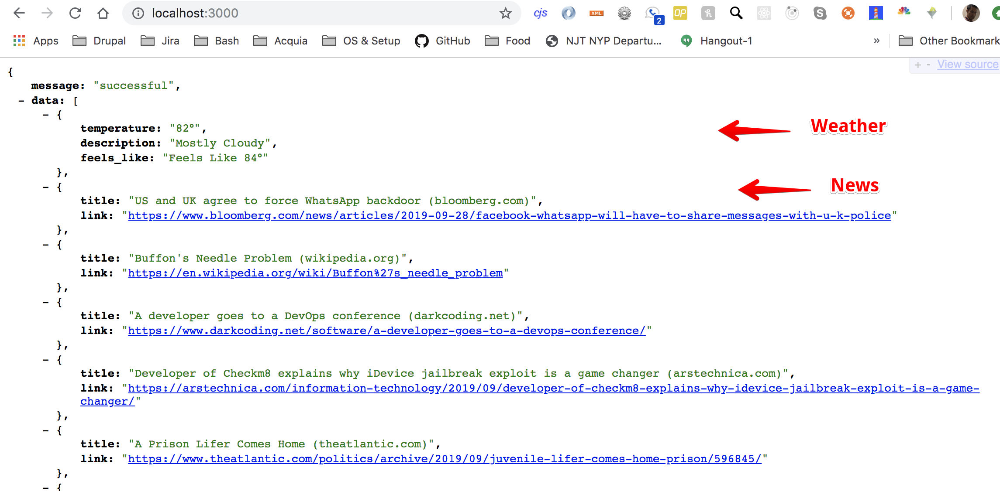
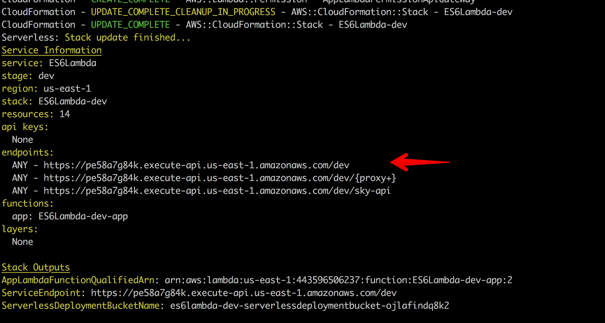

# NodeJS AWS Serverless Lambda News Weather Feed

News and weather feed based on Serverless ES6 NodeJs 10 (AWS stack).

##### Serverless setup (skip if you already done so)
* Go to https://console.aws.amazon.com/iam/home?region=us-east-1#/security_credentials
* Create `New Access Key`
* `npm install -g serverless`
* `serverless config credentials --provider aws --key YOUR_OWN_KEY --secret YOUR_OWN_SECRET`

##### Installation steps
* `git clone git@github.com:general-labs/News-and-Weather.git && cd News-and-Weather`
* Rename `resources/babelrc` to `.babelrc`
* `npm install`
* Run locally: `sls offline`. Visit : `http://localhost:3000/`

##### Push to AWS
* `sls deploy -v`
* Visit `https://<XXUYDHDHDHHDHD>.execute-api.us-east-1.amazonaws.com/dev`

* To remove from AWS `sls remove`
